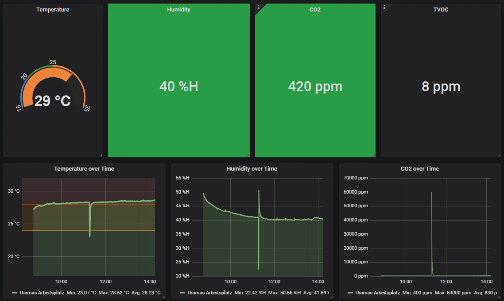
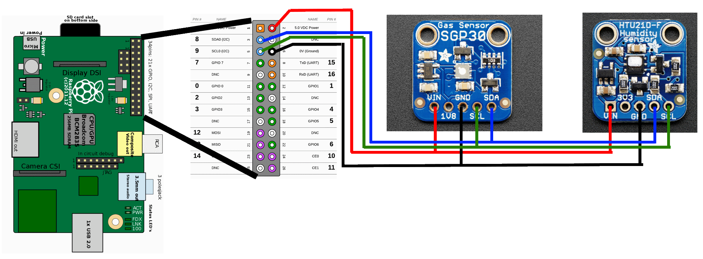

# Raspberry Pi CO2 and Temperature Sensor with Prometheus Exporter

A small Python program that uses a Raspberry PI, [a SGP30 gas sensor](https://www.adafruit.com/product/3709) and [a HTU21D-f temperature sensor](https://www.adafruit.com/product/1899) to measure humidity, temperature, CO2 and TVOC. It exposes these measurements over HTTP in the Prometheus Exporter format so that you can easily store and view them.



## Wiring

(Since everything is I2C you basically need to connect everything that shares names).



## Running

The following was tested on a Raspberry Pi 1 Model A with Raspbian.

```
# enable i2c using raspi-config
apt install -y python3-dev python3-venv i2c-tools
pip3 install --upgrade pip
pip3 install --upgrade setuptools

# clone the repo

virtualenv --no-site-packages --distribute .env
source .env/bin/activate
pip3 install -r requirements.txt
python3 main.py
```

The default port for the Promtheus HTTP server is 8000. A scrape configuration in ``prometheus.yml`` looks like this:
```
- job_name: 'home_office'
  metrics_path: ''
  static_configs:
  - targets: [
    'raspberry-pi:8000'
  ]
```

## Flags

 * ``-v`` -- set log level to DEBUG (default=INFO)

## systemd unit file

TODO