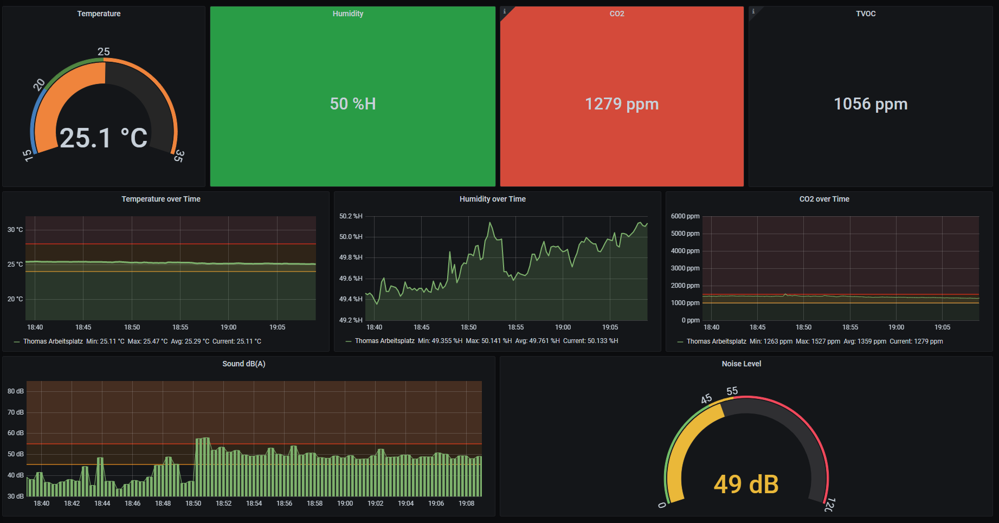

# Raspberry Pi Air Quality Sensor with Prometheus Exporter

A small Python program that uses a Raspberry PI, [a SGP30 gas sensor](https://www.adafruit.com/product/3709) and [a HTU21D-f temperature sensor](https://www.adafruit.com/product/1899) to measure humidity, temperature, CO2 and TVOC. It exposes these measurements over HTTP in the Prometheus Exporter format so that you can easily store and view them.

**Note: I exported the Grafana dashboard to ``doc/grafana-dashboard.json``, so you can import it straight away.**



## Wiring

(Since everything is I2C you basically need to connect everything that shares names).


## Running

The following was tested on a Raspberry Pi 1 Model A with Raspbian.

``` shell
# enable i2c using raspi-config
apt install -y python3-dev python3-venv i2c-tools
pip3 install --upgrade pip
pip3 install --upgrade setuptools

# clone the repo

virtualenv --no-site-packages --distribute .env
source .env/bin/activate
pip install -r requirements.txt
python main.py
```

The default port for the Promtheus HTTP server is 8000. A scrape configuration in ``prometheus.yml`` looks like this:
``` yaml
- job_name: 'home_office'
  metrics_path: ''
  static_configs:
  - targets: [
    'raspberry-pi:8000'
  ]
```

## Flags

 * ``-v`` -- set log level to DEBUG (default=INFO)

## systemd unit file

If you want to keep the measurements running upon restart and automatically start the exporter, you can use the following systemd unit file. For this file the root of the repo is ``/opt/pi-co2``. You need to setup your virtualenv prior to this step (see "Running").
```
vim /etc/systemd/system/pi-co2.service
```

The unit file itself:
```
[Unit]
Description=Export air quality metrics for Prometheus

[Service]
WorkingDirectory=/opt/pi-co2
ExecStart=/opt/pi-co2/.env/bin/python main.py
Restart=always
RestartSec=10

[Install]
WantedBy=multi-user.target
```

Enable auto-start and run:
```
systemctl daemon-reload
systemctl enable pi-co2
systemctl start pi-co2
```